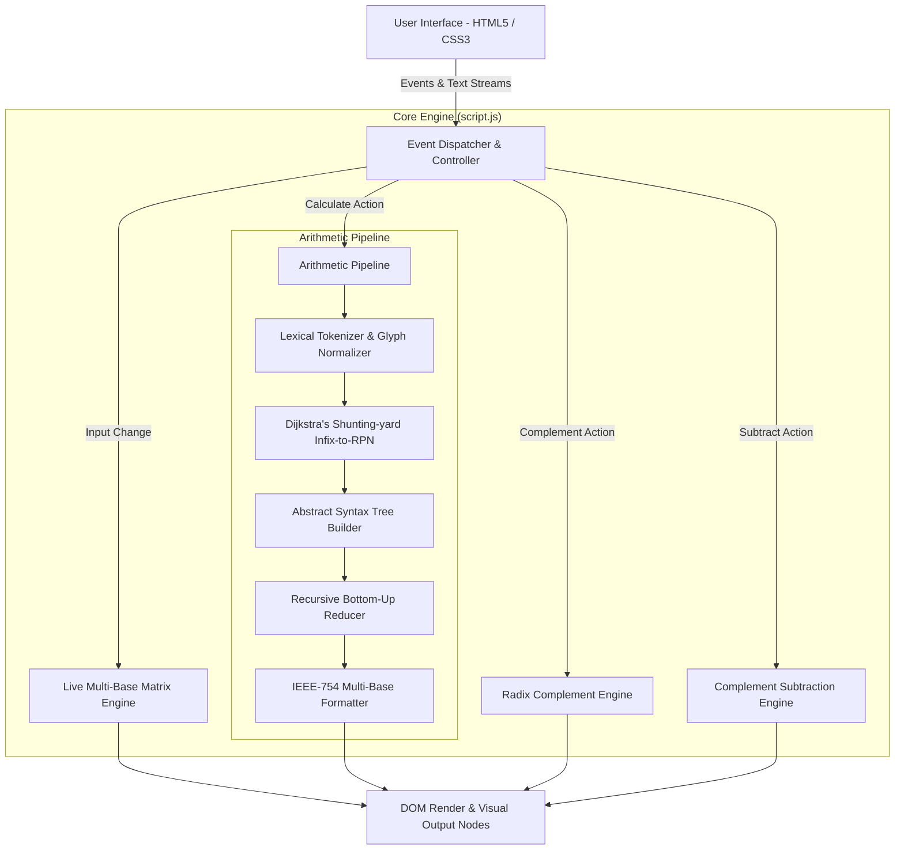

# Software System Requirements Specification (SRS)
## Number System Converter & Unified Algebraic Arithmetic Engine
**Course / Subject:** CPE 463 — Computer Engineering  
**Project Identifier:** `Lyduke56/cpe463-number-system-converter`  
**Document Version:** 1.0.0  
**Date:** September 19, 2026  
**Status:** Approved / Released  

---

## 1. Introduction

### 1.1 Purpose
This document specifies the software, hardware, functional, and non-functional requirements for the **Number System Converter & Unified Algebraic Arithmetic Engine**. It serves as the definitive engineering and baseline reference for implementation, verification, compliance checking, and future maintenance.

### 1.2 Document Conventions
- **Requirement Identifiers:**
  - `FR-xxx`: Functional Requirements (System behavior, algorithms, UI interactions).
  - `NFR-xxx`: Non-Functional Requirements (Performance, usability, reliability, security).
  - `EIR-xxx`: External Interface Requirements (Hardware, software, and browser interfaces).
- **Requirement Priority Levels (RFC 2119):**
  - **MUST / SHALL:** Mandatory core requirement.
  - **SHOULD:** Recommended requirement unless valid architectural justification exists.
  - **MAY:** Optional feature or future extension.

### 1.3 Intended Audience & Stakeholders
- **Course Instructors & Evaluators (CPE 463):** For evaluating engineering rigor, algorithmic completeness, and adherence to positional numeral system principles.
- **Computer Engineering & Computer Science Students:** For learning radix transformations, positional arithmetic, radix/diminished-radix complements, and computer arithmetic.
- **Software Engineers & Maintainers:** For reviewing architecture, data structures (AST, Shunting-yard), and edge-case handling.

### 1.4 Project Scope & Objectives
The system is a standalone, client-side, browser-native mathematical utility engineered to:
1. Accept dynamic variables ($A, B, C, \dots$) represented in heterogeneous radices: **Binary (Base 2)**, **Octal (Base 8)**, **Decimal (Base 10)**, and **Hexadecimal (Base 16)**.
2. Dynamically compute and display real-time live cross-conversions across all four bases for each individual row.
3. Parse and evaluate arbitrary infix algebraic expressions involving variables and operators ($+$, $-$, $\times$, $\div$, parentheses, unary negation) according to standard algebraic operator precedence (PEMDAS / BODMAS) and associativity.
4. Provide step-by-step bottom-up reduction trees tracing the decimal evaluation pipeline and multi-base substitutions.
5. Compute $(r-1)$'s and $r$'s complements for all four bases with auto or custom digit bit-widths.
6. Execute binary/octal/decimal/hexadecimal subtractions via both $(r-1)$'s complement (with end-around carry) and $r$'s complement (with discard carry) side-by-side.

---

## 2. Overall Description

### 2.1 Product Perspective & Context
The application operates entirely within the client runtime environment (web browser). It does not require a remote server, third-party backend, cloud API, or package manager. The architecture comprises a presentation tier ([`index.html`](file:///c:/Users/Clyde%20Justine%20Rosal/Desktop/Project%20Stockify/cpe463-number-system-converter/index.html)), a styling and layout tier ([`style.css`](file:///c:/Users/Clyde%20Justine%20Rosal/Desktop/Project%20Stockify/cpe463-number-system-converter/style.css)), and a computational logic tier ([`script.js`](file:///c:/Users/Clyde%20Justine%20Rosal/Desktop/Project%20Stockify/cpe463-number-system-converter/script.js)).

### 2.2 System Architecture Diagram

### 2.3 User Classes & Personas
- **General Engineering Student:** Uses the application to verify homework solutions involving radix arithmetic, complement subtraction, and algebraic order of operations.
- **Educator / Lecturer:** Uses the step-by-step reduction accordion and side-by-side subtraction cards to visually demonstrate end-around carry vs. carry-discard in classroom lectures.
- **Embedded / Systems Programmer:** Uses the complement generator to quickly determine bitwise sign inversion, two's complement hex masks, and fixed-width representations.

### 2.4 Design & Implementation Constraints
- **Zero-Dependency Constraint:** The system must not rely on external JavaScript libraries (e.g., Math.js, jQuery, React) or external CSS frameworks (e.g., Tailwind, Bootstrap).
- **Offline Portability:** The system must be capable of launching directly from local storage via the `file://` protocol without requiring an active internet connection.
- **Client-Side Execution:** All calculations must run synchronously or via non-blocking microtasks on the client machine's browser thread.

---

## 3. System Environment & Specifications

### 3.1 Client Hardware Requirements

| Hardware Component | Minimum Requirement | Recommended Specification |
| :--- | :--- | :--- |
| **Processor (CPU)** | 1.0 GHz x86/x64 or ARM dual-core | 2.0 GHz+ quad-core (Intel Core i3/Apple M-series/AMD Ryzen or higher) |
| **Random Access Memory (RAM)** | 512 MB free available RAM | 2 GB+ free system RAM |
| **Storage (Disk Space)** | < 10 MB available disk space | 50 MB available disk space |
| **Display Resolution** | 360 × 640 px (Mobile viewport) | 1920 × 1080 px (Full HD Desktop display) |
| **Input Peripherals** | Keyboard and Pointer (Mouse, Trackpad, or Touchscreen) | Full physical keyboard with precision mouse/trackpad |

### 3.2 Client Software & Browser Requirements

| Software Environment | Minimum Supported Version | Recommended Version |
| :--- | :--- | :--- |
| **Google Chrome** | Version 80+ | Latest Stable Release |
| **Mozilla Firefox** | Version 75+ | Latest Stable Release |
| **Microsoft Edge** | Version 80+ (Chromium-based) | Latest Stable Release |
| **Apple Safari** | Version 13.1+ (macOS / iOS) | Latest Stable Release |
| **Operating System** | Windows 10/11, macOS 10.15+, Ubuntu 20.04+, Android 10+, iOS 14+ | Windows 11, macOS Sonoma, or modern Linux desktop |
| **JavaScript Engine** | ECMAScript 2020 (ES11) compliant | V8, SpiderMonkey, or JavaScriptCore with ES2022+ |

### 3.3 Server & Hosting Infrastructure
- **Server Platform:** Any static web server (NGINX, Apache HTTP Server, GitHub Pages, Netlify, Cloudflare Pages) or local filesystem via `file://`.
- **MIME Type Requirements:**
  - `.html` $\rightarrow$ `text/html`
  - `.css` $\rightarrow$ `text/css`
  - `.js` $\rightarrow$ `application/javascript`
  - `.md` $\rightarrow$ `text/markdown`

---

## 4. Functional Requirements (FR)

### Module 1: Dynamic Multi-Base Inputs & Live Conversion Matrix

- **`FR-101` [Input Count Configuration]:**
  - The system **MUST** allow the user to specify an input count of $N \ge 3$.
  - The default input count **SHALL** be 3 (variables $A, B, C$).
  - When the user updates the input count, existing row values and selected bases **MUST** be preserved up to $\min(N_{\text{old}}, N_{\text{new}})$.
- **`FR-102` [Supported Number Systems]:**
  - The system **MUST** support the following positional bases:
    1. **Binary:** Base 2, valid glyphs `0` and `1`.
    2. **Octal:** Base 8, valid glyphs `0` through `7`.
    3. **Decimal:** Base 10, valid glyphs `0` through `9`.
    4. **Hexadecimal:** Base 16, valid glyphs `0` through `9` and case-insensitive letters `A` through `F`.
- **`FR-103` [Real-Time Character Validation]:**
  - The system **MUST** inspect input characters on the `input` event.
  - Invalid characters for the active radix **MUST** be flagged with visual error highlighting (red borders, inline warning message).
- **`FR-104` [Live 4-Base Conversion Matrix]:**
  - Each individual row **MUST** render four live conversion cells representing the current input value converted simultaneously to Binary, Octal, Decimal, and Hexadecimal.
  - Conversions **MUST** update automatically as the user types without requiring a manual calculate click.
- **`FR-105` [Floating-Point Radix Conversion]:**
  - Input fields **MUST** permit valid radix points (`.`):
    - Base 2: e.g., `101.101`
    - Base 8: e.g., `12.4`
    - Base 10: e.g., `10.5`
    - Base 16: e.g., `A.8`
- **`FR-106` [Negative Sign Handling]:**
  - Inputs **MUST** accept an optional leading negative sign (`-`), propagating the signed decimal value across all representations.

---

### Module 2: Expression Parser & Operator Precedence Engine

- **`FR-201` [Tokenization & Normalization]:**
  - The tokenizer **MUST** parse string inputs into typed tokens: `NUMBER`, `VARIABLE`, `OPERATOR`, `LPAREN`, `RPAREN`.
  - Non-standard mathematical glyphs **MUST** be normalized automatically:
    - Multiplication: `×`, `*` $\rightarrow$ `*`
    - Division: `÷`, `/` $\rightarrow$ `/`
    - Subtraction / Negation: `−`, `-` $\rightarrow$ `-`
- **`FR-202` [Implicit Multiplication Insertion]:**
  - The lexer **MUST** detect implicit multiplication juxtaposition and inject an explicit multiplication operator:
    - Variable following Variable: `AB` $\rightarrow$ `A * B`
    - Number preceding Variable: `2A` $\rightarrow$ `2 * A`
    - Parenthesis juxtaposition: `(A + B)(C + D)` $\rightarrow$ `(A + B) * (C + D)`
    - Value adjacent to grouping: `3(A + B)` $\rightarrow$ `3 * (A + B)`
- **`FR-203` [Unary Negation Disambiguation]:**
  - The lexer **MUST** distinguish binary subtraction from unary negation:
    - A minus sign at the beginning of an expression or immediately following an operator or left parenthesis (`( -A )` or `-A + B`) **MUST** be classified as unary negation (`NEG`).
- **`FR-204` [Operator Precedence & Associativity Hierarchy]:**
  - The engine **MUST** enforce the following strict evaluation hierarchy:

    | Precedence | Operator | Operation | Associativity |
    | :---: | :---: | :--- | :---: |
    | **3 (Highest)** | `NEG` (`−`) | Unary Negation | Right-to-Left |
    | **2** | `*`, `/` | Multiplication, Division | Left-to-Right |
    | **1 (Lowest)** | `+`, `-` | Addition, Subtraction | Left-to-Right |

- **`FR-205` [Dijkstra's Shunting-Yard Algorithm]:**
  - The system **MUST** transform infix token streams into postfix (Reverse Polish Notation) queues using an operator stack that respects precedence and parenthesis grouping.
- **`FR-206` [Parenthesis Balance Verification]:**
  - The parser **MUST** reject expressions with mismatched or unclosed parentheses, raising descriptive syntax errors before execution.

---

### Module 3: Abstract Syntax Tree (AST) & Step-by-Step Reduction

- **`FR-301` [AST Generation]:**
  - The system **MUST** construct an Abstract Syntax Tree from the RPN queue:
    - Leaves represent numeric constants or bound variables ($A, B, C, \dots$).
    - Internal nodes represent unary or binary operators.
- **`FR-302` [Variable Binding]:**
  - Variables in the AST **MUST** be substituted with their corresponding decimal representations parsed from the input rows.
  - If an expression references a variable not defined in the active input rows (e.g., referencing $D$ when only $A, B, C$ are generated), the system **MUST** halt and display an undefined variable error.
- **`FR-303` [Recursive Bottom-Up Reduction]:**
  - The engine **MUST** locate the deepest, highest-precedence reducible node in the tree.
  - It **MUST** calculate the intermediate decimal result, replace the subtree with a scalar node, record the evaluation snapshot, and repeat until only a root scalar remains.
- **`FR-304` [Step Breakdown Generation]:**
  - Each intermediate reduction step **MUST** be formatted as a numbered list entry showing:
    - The active sub-expression being evaluated (e.g., $10 + 10 = 20$).
    - The resulting overall expression state.
- **`FR-305` [Mathematical Subscript Substitution]:**
  - The UI **MUST** display the initial multi-base equation with Unicode radix subscripts (e.g., $A_{1010_2} + B_{12_8} - C_{25_{10}}$).

---

### Module 4: Numeric Formatting & Precision

- **`FR-401` [IEEE-754 Double Precision]:**
  - All arithmetic operations **MUST** be computed using 64-bit floating point precision (IEEE-754).
- **`FR-402` [Fractional Base Conversion]:**
  - Fractional values **MUST** be converted into their respective target bases via successive radix multiplication:
    $$f_{k+1} = \operatorname{frac}(f_k \times r), \quad d_k = \lfloor f_k \times r \rfloor$$
  - Conversions **MUST** terminate when the fractional part becomes zero or reaches a precision limit of 6 fractional places.
- **`FR-403` [Trailing Zero Suppression]:**
  - Fractional base representations **MUST** trim redundant trailing zeros (e.g., `10.1000` $\rightarrow$ `10.1`).
- **`FR-404` [Negative Result Rendering]:**
  - Negative values **MUST** be displayed with a leading minus sign across all four output tiles (e.g., $-155_{10} = -10011011_2 = -233_8 = -9B_{16}$).
- **`FR-405` [Division by Zero Guard]:**
  - Any evaluation involving division by zero ($x \div 0$) **MUST** be caught safely before generating `NaN` or `Infinity`, triggering a user-friendly error banner.

---

### Module 5: Radix & Diminished-Radix Complement Engine

- **`FR-501` [Universal Base Complement Support]:**
  - The system **MUST** compute both $(r-1)$'s and $r$'s complements for all 4 bases:
    - **Binary (Base 2):** 1's complement and 2's complement.
    - **Octal (Base 8):** 7's complement and 8's complement.
    - **Decimal (Base 10):** 9's complement and 10's complement.
    - **Hexadecimal (Base 16):** 15's complement and 16's complement.
- **`FR-502` [Mathematical Complement Formulation]:**
  - For an $n$-digit integer $N$ in base $r$:
    - $(r-1)$'s Complement: $C_{r-1} = (r^n - 1) - N$ (subtracting each digit from $r-1$).
    - $r$'s Complement: $C_r = r^n - N = C_{r-1} + 1$.
- **`FR-503` [Configurable Bit/Digit Width]:**
  - The system **MUST** support an "Auto" mode where digit width $n$ matches input length.
  - The system **MUST** support manual digit width selection (e.g., 4-bit, 8-bit, 16-bit, custom $n \ge \text{length}(N)$).
  - Inputs exceeding specified digit width **MUST** be padded with leading zeros or flagged with overflow warnings.
- **`FR-504` [Digit-by-Digit Computation Steps]:**
  - The UI **MUST** display step-by-step arithmetic showing:
    - The maximum digit minuend (e.g., `1111` for 4-bit binary or `9999` for 4-digit decimal).
    - Digit-by-digit subtraction yielding $(r-1)$'s complement.
    - Addition of $+1$ to yield $r$'s complement with carry propagation.
- **`FR-505` [Complement Multi-Base Matrix]:**
  - Computed complement values **MUST** be displayed simultaneously across Binary, Octal, Decimal, and Hexadecimal.
- **`FR-506` [Complement Quick Presets]:**
  - The UI **MUST** include one-click presets for BIN 4-bit, BIN 8-bit, OCT 3-digit, DEC 4-digit, and HEX 3-digit.

---

### Module 6: Subtraction via Complements Engine

- **`FR-601` [Dual Complement Subtraction Methods]:**
  - The system **MUST** execute subtraction $M - S$ ($M$: Minuend, $S$: Subtrahend) side-by-side using:
    - **Method 1:** $(r-1)$'s Complement Method.
    - **Method 2:** $r$'s Complement Method.
- **`FR-602` [Digit Width Alignment]:**
  - Both operands $M$ and $S$ **MUST** be normalized to the same digit width $n = \max(\text{len}(M), \text{len}(S))$.
- **`FR-603` [Method 1 Execution: $(r-1)$'s Complement]:**
  - **Step 1:** Compute $(r-1)$'s complement of $S$.
  - **Step 2:** Add $M + C_{r-1}(S)$.
  - **Step 3 (End-Around Carry Check):**
    - If Carry $= 1$: Result is positive. Add the carry to the least significant digit (End-Around Carry).
    - If Carry $= 0$: Result is negative. Re-complement the sum using $(r-1)$'s complement and prepend a negative sign.
- **`FR-604` [Method 2 Execution: $r$'s Complement]:**
  - **Step 1:** Compute $r$'s complement of $S$.
  - **Step 2:** Add $M + C_r(S)$.
  - **Step 3 (Carry Discard Check):**
    - If Carry $= 1$: Result is positive. Discard the carry.
    - If Carry $= 0$: Result is negative. Re-complement the sum using $r$'s complement and prepend a negative sign.
- **`FR-605` [Cross-Base Subtraction]:**
  - The system **MUST** allow minuend and subtrahend to have different radices (e.g., $M = 1010_2$, $S = 5_{10}$).
  - Operands **MUST** be converted into a common working radix prior to digit alignment and complement calculation.
- **`FR-606` [Subtraction Step Cards]:**
  - The UI **MUST** display dedicated side-by-side cards with numbered sequential steps showing exact carries, additions, and final magnitude determinations.
- **`FR-607` [Subtraction Quick Presets]:**
  - Quick presets **MUST** cover Binary, Octal, Decimal, Hexadecimal, and a negative outcome scenario ($M < S$).

---

### Module 7: User Interface, Virtual Keypad & Presets

- **`FR-701` [Virtual Variable & Operator Keypad]:**
  - The UI **MUST** render dynamic variable buttons corresponding to current inputs ($A, B, C, \dots$).
  - The UI **MUST** provide tactile buttons for operators (`+`, `−`, `×`, `÷`), grouping (`(`, `)`), and backspace (`⌫`).
- **`FR-702` [Cursor-Aware Insertion]:**
  - Keypad button clicks **MUST** insert tokens at the active cursor position in the expression input bar.
- **`FR-703` [Arithmetic Test Presets]:**
  - The system **MUST** provide at least 5 pre-configured multi-base test cases:
    - **Preset 1:** BIN + OCT + DEC $\rightarrow$ `(A + B) * C`
    - **Preset 2:** BIN + DEC + HEX $\rightarrow$ `(A + B) - C`
    - **Preset 3:** OCT + DEC + HEX $\rightarrow$ `(A - B) / C`
    - **Preset 4:** BIN + OCT + HEX $\rightarrow$ `(A * B) / C`
    - **Preset 5 (Default):** BIN + OCT + DEC + HEX $\rightarrow$ `(A + B - C) * D`
- **`FR-704` [Expression Presets Chips]:**
  - Clickable expression chips **MUST** instantly populate common algebraic formulas into the input bar.
- **`FR-705` [Collapsible Step Accordion]:**
  - The intermediate step breakdown **MUST** feature an expandable/collapsible accordion with step counter badges.
- **`FR-706` [Mode Toggling]:**
  - The Complement & Subtraction section **MUST** offer smooth tab switching between "Complement Display" and "Subtraction via Complements".

---

### Module 8: Error Handling & Diagnostic Feedback

- **`FR-801` [Global Error Banner]:**
  - The system **MUST** feature a dismissible global alert banner that presents human-readable error titles and actionable diagnostic descriptions.
- **`FR-802` [Radix Character Violation]:**
  - Real-time inline feedback **MUST** immediately indicate non-radix digits (e.g., "Digit '9' is invalid for Base 8").
- **`FR-803` [Expression Syntax Diagnostics]:**
  - Syntax errors (consecutive operators `++`, empty parentheses `()`, missing operands `A +`) **MUST** be explicitly diagnosed.
- **`FR-804` [Non-Crashing Fault Tolerance]:**
  - Erroneous inputs **MUST NOT** throw uncaught JavaScript exceptions or lock the user interface.
- **`FR-805` [Empty Input Graceful Degradation]:**
  - Blank inputs **MUST** be treated as zero or prompt clear missing-field notifications.

---

## 5. Non-Functional Requirements (NFR)

### 5.1 Performance & Latency Requirements
- **`NFR-PERF-01` [Live Input Response Latency]:**
  - Live 4-base conversion matrix updates **SHALL** render in less than **16 milliseconds** (maintaining 60 FPS UI responsiveness) upon keystroke events.
- **`NFR-PERF-02` [Arithmetic Evaluation Throughput]:**
  - Complete tokenization, Shunting-yard parsing, AST generation, and bottom-up reduction for expressions up to 50 tokens **SHALL** complete in under **50 milliseconds**.
- **`NFR-PERF-03` [Memory Footprint]:**
  - The maximum memory footprint in browser tab memory **SHALL NOT** exceed **35 MB** during continuous interactive sessions.
- **`NFR-PERF-04` [Asset Footprint]:**
  - Total web bundle size (HTML, CSS, JS combined) **SHALL** remain below **250 KB** uncompressed, ensuring instantaneous load times even on constrained 2G/3G mobile networks.

### 5.2 Usability & Human Factors
- **`NFR-USE-01` [Responsive Layout Support]:**
  - The user interface **SHALL** dynamically adapt to viewport widths ranging from **360px** (mobile smartphones) to **3840px** (4K UHD displays) without horizontal scrolling or broken grids.
- **`NFR-USE-02` [Visual Ergonomics & Contrast]:**
  - The UI design system **SHALL** comply with **WCAG 2.1 Level AA** contrast ratios ($\ge 4.5:1$ for normal text, $\ge 3:1$ for large text and interactive boundaries).
- **`NFR-USE-03` [Accessibility & Screen Readers]:**
  - Form controls **SHALL** include accessible labels (`aria-label`, `<label for="...">`), and the global error banner **SHALL** utilize `role="alert"`.
- **`NFR-USE-04` [Keyboard Accessibility]:**
  - All interactive elements (keypad buttons, presets, accordions, inputs) **SHALL** be fully navigable and activatable via standard keyboard tab order and Enter/Space keys.

### 5.3 Reliability, Accuracy & Robustness
- **`NFR-REL-01` [Deterministic Calculations]:**
  - Given identical input numbers and expression tokens, the system **SHALL** produce identical mathematical outputs 100% of the time across all supported operating systems and browsers.
- **`NFR-REL-02` [IEEE-754 Numeric Safety]:**
  - The engine **SHALL** handle edge-case IEEE-754 states (`-0`, subnormals, float rounding) cleanly without producing unformatted scientific notation in base representations.
- **`NFR-REL-03` [Zero Unhandled Exception Policy]:**
  - All computational pipelines **SHALL** be encapsulated in defensive boundary checks, guaranteeing zero uncaught runtime crashes.

### 5.4 Maintainability & Code Quality
- **`NFR-MNT-01` [Separation of Concerns]:**
  - Codebase **SHALL** maintain strict separation between markup ([`index.html`](file:///c:/Users/Clyde%20Justine%20Rosal/Desktop/Project%20Stockify/cpe463-number-system-converter/index.html)), presentation rules ([`style.css`](file:///c:/Users/Clyde%20Justine%20Rosal/Desktop/Project%20Stockify/cpe463-number-system-converter/style.css)), and algorithm execution ([`script.js`](file:///c:/Users/Clyde%20Justine%20Rosal/Desktop/Project%20Stockify/cpe463-number-system-converter/script.js)).
- **`NFR-MNT-02` [Modular Architecture]:**
  - Logic routines (lexing, RPN conversion, AST evaluation, complement math) **SHALL** be organized as cohesive, self-documenting functions with clear parameter contracts.
- **`NFR-MNT-03` [Self-Contained Portability]:**
  - The codebase **SHALL NOT** require build tools, transpilers (Babel), or bundlers (Webpack/Vite) to function.

### 5.5 Security & Privacy
- **`NFR-SEC-01` [Client-Side Privacy]:**
  - No user-entered values, equations, or calculation results **SHALL** be transmitted over the network or saved to third-party servers.
- **`NFR-SEC-02` [Code Execution Defense]:**
  - The application **SHALL NOT** use `eval()`, `new Function()`, or `setTimeout("string")` to parse or evaluate mathematical expressions, mitigating Cross-Site Scripting (XSS) and injection vectors.

---

## 6. External Interface Requirements

### 6.1 User Interface Design Specifications

| Component | UI Specification |
| :--- | :--- |
| **Color System** | Dark slate / navy theme (`#0f172a`, `#1e293b`), vibrant accents (`#38bdf8`, `#818cf8`), semantic states (Success: `#22c55e`, Error: `#ef4444`, Warning: `#f59e0b`). |
| **Typography** | Modern system font stack (`system-ui`, `-apple-system`, `Segoe UI`, `Roboto`, `sans-serif`) with monospace font for all mathematical numbers and base outputs. |
| **Subscripts** | Unicode mathematical subscript characters ($₂$, $₈$, $₁₀$, $₁₆$) rendered for direct visual verification of radices. |
| **Keypad** | Responsive CSS Grid layout with distinct visual styles for variables, operators, and action buttons. |
| **Result Tiles** | Quad-card grid (Binary, Octal, Decimal, Hexadecimal) featuring high-contrast copyable outputs. |

### 6.2 Hardware Interfaces
- **Pointer Device:** Mouse, trackball, or capacitive touch digitizer capable of dispatching standard pointer/click events.
- **Keyboard Device:** Standard QWERTY or international keyboard capable of emitting standard `keydown` and `input` events.

### 6.3 Software & Web Platform Interfaces
- **W3C DOM Level 4:** Element selection, event listeners, dynamic node manipulation.
- **HTML5 Input Events:** Real-time event hooks (`input`, `change`, `click`).
- **CSS3 Flexible Box & Grid Layout:** For adaptive 2D layout rendering.

---

## 7. Requirements Traceability & Verification Matrix

| Req ID | Requirement Description | Implementing Source File & Functions | Verification Method |
| :--- | :--- | :--- | :--- |
| **`FR-101`** | Dynamic variable row scaling ($N \ge 3$) | [`script.js`](file:///c:/Users/Clyde%20Justine%20Rosal/Desktop/Project%20Stockify/cpe463-number-system-converter/script.js) (`renderInputs`, `updateInputCount`) | Manual UI test with counts: 3, 5, 10 |
| **`FR-102`** | 4-Base validation (2, 8, 10, 16) | [`script.js`](file:///c:/Users/Clyde%20Justine%20Rosal/Desktop/Project%20Stockify/cpe463-number-system-converter/script.js) (`isValidNumber`, `BASE_REGEX`) | Unit test with valid/invalid characters per base |
| **`FR-104`** | Live 4-base conversion matrix | [`script.js`](file:///c:/Users/Clyde%20Justine%20Rosal/Desktop/Project%20Stockify/cpe463-number-system-converter/script.js) (`updateRowConversions`, `parseToDecimal`, `formatBase`) | Real-time typing verification in row fields |
| **`FR-201`** | Tokenization & Unicode normalization | [`script.js`](file:///c:/Users/Clyde%20Justine%20Rosal/Desktop/Project%20Stockify/cpe463-number-system-converter/script.js) (`tokenizeExpression`) | Test string containing `×`, `÷`, `−` |
| **`FR-202`** | Implicit multiplication insertion | [`script.js`](file:///c:/Users/Clyde%20Justine%20Rosal/Desktop/Project%20Stockify/cpe463-number-system-converter/script.js) (`insertImplicitMultiplication`) | Test `2A`, `(A+B)(C+D)`, `A B` |
| **`FR-204`** | Operator Precedence & Associativity | [`script.js`](file:///c:/Users/Clyde%20Justine%20Rosal/Desktop/Project%20Stockify/cpe463-number-system-converter/script.js) (`OPERATOR_PRECEDENCE`, `shuntingYard`) | Verify `A + B * C` evaluates as `A + (B * C)` |
| **`FR-301`** | AST generation from RPN | [`script.js`](file:///c:/Users/Clyde%20Justine%20Rosal/Desktop/Project%20Stockify/cpe463-number-system-converter/script.js) (`buildAST`) | Verify tree structure on nested expressions |
| **`FR-303`** | Bottom-Up reduction engine | [`script.js`](file:///c:/Users/Clyde%20Justine%20Rosal/Desktop/Project%20Stockify/cpe463-number-system-converter/script.js) (`reduceASTStepByStep`) | Verify intermediate steps logged match manual computation |
| **`FR-402`** | Fractional base conversion | [`script.js`](file:///c:/Users/Clyde%20Justine%20Rosal/Desktop/Project%20Stockify/cpe463-number-system-converter/script.js) (`formatBaseFractional`) | Test fractional inputs: $10.5_{10} = 1010.1_2$ |
| **`FR-405`** | Division by zero detection | [`script.js`](file:///c:/Users/Clyde%20Justine%20Rosal/Desktop/Project%20Stockify/cpe463-number-system-converter/script.js) (`evaluateASTNode`) | Test expression `A / 0` |
| **`FR-501`** | Complements for all 4 bases | [`script.js`](file:///c:/Users/Clyde%20Justine%20Rosal/Desktop/Project%20Stockify/cpe463-number-system-converter/script.js) (`computeComplements`) | Test BIN 1s/2s, OCT 7s/8s, DEC 9s/10s, HEX 15s/16s |
| **`FR-601`** | Subtraction via complements | [`script.js`](file:///c:/Users/Clyde%20Justine%20Rosal/Desktop/Project%20Stockify/cpe463-number-system-converter/script.js) (`subtractViaComplements`) | Test end-around carry ($M > S$) & negative cases ($M < S$) |
| **`FR-703`** | Built-in test presets (1–5) | [`script.js`](file:///c:/Users/Clyde%20Justine%20Rosal/Desktop/Project%20Stockify/cpe463-number-system-converter/script.js) (`loadPreset`) | Click all 5 presets; verify calculated output against README |
| **`NFR-PERF-01`** | < 16ms input responsiveness | [`script.js`](file:///c:/Users/Clyde%20Justine%20Rosal/Desktop/Project%20Stockify/cpe463-number-system-converter/script.js) (`EventListener`) | Chrome DevTools Performance profiler |
| **`NFR-SEC-02`** | No `eval()` usage | [`script.js`](file:///c:/Users/Clyde%20Justine%20Rosal/Desktop/Project%20Stockify/cpe463-number-system-converter/script.js) | Static code grep / code review |
