# Standard Programming Flowcharts & Architectural Diagrams
## CPE463 - Number System Converter & Unified Arithmetic Calculator

**File Reference:** [`script.js`](../script.js) | [`index.html`](../index.html) | [`PSEUDOCODE.md`](PSEUDOCODE.md)

---

## Standard Flowchart Symbols Legend (ANSI / ISO 5807)

These flowcharts strictly follow traditional Computer Science and Engineering flowchart conventions:

| Symbol Shape | Geometric Form | Mermaid Syntax | Standard Programming Function |
| :--- | :--- | :--- | :--- |
| **Terminal / Ellipse** | Oval / Stadium | `([Start / End])` | Indicates Start, End, Return, or Halt of a program or function. |
| **Manual Input** | Trapezoid | `[/User Action\]` | Represents manual human input (e.g., clicking buttons, typing in text fields). |
| **Input / Output (I/O)** | Parallelogram | `[/Read or Print/]` | Represents reading data (variables, DOM) or displaying outputs/results to the user. |
| **Process** | Rectangle | `[Operation]` | Represents computational operations, variable assignments, and arithmetic. |
| **Decision** | Diamond | `{Condition?}` | Represents conditional branching (`IF...THEN...ELSE` or `SWITCH`) with `Yes`/`No` paths. |
| **Preparation / Loop** | Hexagon | `{{For Loop Setup}}` | Represents iteration setup, loop counters, and index initialization. |
| **Predefined Process** | Double-Bar Rectangle | `[[Function Call]]` | Represents invocation of another modular function or subroutine. |

---

## 1. Master System Flowchart

Shows the overall execution lifecycle, 3-tab segmented navigation routing, dynamic field rebuilds, preset injection, and engine coordination.

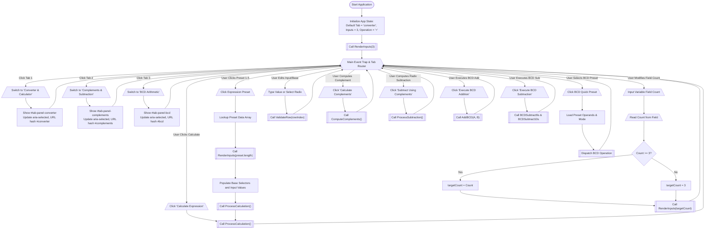

---

## 2. Main Calculation Engine Flowchart (`ProcessCalculation`)

Details the entire 4-phase arithmetic pipeline featuring loop iteration, sub-function calls, sequential chain arithmetic, division-by-zero detection, and output generation.

```mermaid
flowchart TD
    StartCalc(["Start ProcessCalculation()"]) --> ReadDOMRows[/Read All Input Rows from DOM/]
    ReadDOMRows --> InitFlags["allValid = true<br/>decimalValues = [ ]<br/>originalTokens = [ ]<br/>decimalTokens = [ ]"]

    %% Phase 1: Input Harvesting & Per-Row Conversion
    InitFlags --> PrepLoop{{For i = 1 to TotalRows}}
    PrepLoop --> ReadRowIO[/Read base and rawVal for Row i/]
    ReadRowIO --> CheckEmpty{"rawVal is Empty?"}

    CheckEmpty -->|"Yes"| OutEmptyErr[/Display 'Input cannot be empty' Error/]
    OutEmptyErr --> ClearRowMatrix1[/Clear Row i Conversion Matrix/]
    ClearRowMatrix1 --> FlagInvalid1["allValid = false"]
    FlagInvalid1 --> NextRowStep

    CheckEmpty -->|"No"| CallValidate[["IsValidNumber(rawVal, base)"]]
    CallValidate --> CheckValidResult{"Is Valid?"}

    CheckValidResult -->|"No"| OutCharErr[/Display 'Invalid character' Error/]
    OutCharErr --> ClearRowMatrix2[/Clear Row i Conversion Matrix/]
    ClearRowMatrix2 --> FlagInvalid2["allValid = false"]
    FlagInvalid2 --> NextRowStep

    CheckValidResult -->|"Yes"| ClearErrUI["Remove Error Styling on Row i"]
    ClearErrUI --> CallParse[["decVal = ParseToDecimal(rawVal, base)"]]
    CallParse --> AppendDec["Append decVal to decimalValues"]

    AppendDec --> CallFormatBin[["binStr = FormatBase(decVal, 2, 0)"]]
    CallFormatBin --> CallFormatOct[["octStr = FormatBase(decVal, 8, 0)"]]
    CallFormatOct --> CallFormatHex[["hexStr = FormatBase(decVal, 16, 0)"]]
    CallFormatHex --> DisplayRowMatrix[/Output Row i Matrix: BIN, OCT, DEC, HEX/]

    DisplayRowMatrix --> BuildToken["Append (rawVal + Subscript) to originalTokens<br/>Append decVal to decimalTokens"]
    BuildToken --> NextRowStep["Increment i"]
    NextRowStep --> PrepLoop

    %% Validation Guard
    PrepLoop -->|"Loop Complete"| CheckAllValid{"allValid == true AND<br/>decimalValues.length == TotalRows?"}
    CheckAllValid -->|"No"| HideResults["Hide Results Section"]
    HideResults --> ExitCalc(["Halt / Return"])

    %% Phase 2: Sequential Decimal Arithmetic
    CheckAllValid -->|"Yes"| InitMath["computedResult = decimalValues[0]<br/>isDivByZero = false<br/>divZeroIndex = null"]
    InitMath --> MathLoop{{For k = 1 to TotalRows - 1}}

    MathLoop --> FetchNext["nextVal = decimalValues[k]"]
    FetchNext --> BranchOp{"currentOperation"}

    BranchOp -->|"+"| DoAdd["computedResult = computedResult + nextVal"] --> NextK["Increment k"]
    BranchOp -->|"-"| DoSub["computedResult = computedResult - nextVal"] --> NextK
    BranchOp -->|"*"| DoMul["computedResult = computedResult * nextVal"] --> NextK
    BranchOp -->|"/"| CheckZero{"nextVal == 0?"}

    CheckZero -->|"Yes"| SetDivZero["isDivByZero = true<br/>divZeroIndex = k + 1"]
    SetDivZero --> BreakLoop["Break Out of Math Loop"]
    CheckZero -->|"No"| DoDiv["computedResult = computedResult / nextVal"] --> NextK
    NextK --> MathLoop

    MathLoop -->|"Math Complete"| CheckDivFlag{"isDivByZero == true?"}
    BreakLoop --> CheckDivFlag

    %% Phase 3 & 4: Output Rendering
    CheckDivFlag -->|"Yes"| ShowDivZeroErr[/Output 'Division by Zero' Error on Input divZeroIndex/]
    ShowDivZeroErr --> FormatFormulaErr["formula = decimalTokens + ' = Undefined'"]
    FormatFormulaErr --> OutTilesErr[/Display 'Undefined (Div by 0)' on All 4 Final Tiles/]

    CheckDivFlag -->|"No"| FormatFormulaNormal["formula = decimalTokens + ' = ' + computedResult"]
    FormatFormulaNormal --> FinalBin[["finalBin = FormatBase(computedResult, 2, 6)"]]
    FinalBin --> FinalOct[["finalOct = FormatBase(computedResult, 8, 6)"]]
    FinalOct --> FinalDec[["finalDec = FormatBase(computedResult, 10, 6)"]]
    FinalDec --> FinalHex[["finalHex = FormatBase(computedResult, 16, 6)"]]
    FinalHex --> OutTilesNormal[/Display finalBin, finalOct, finalDec, finalHex on Result Tiles/]

    OutTilesErr --> DisplayExpr[/Output expressionString to expression-display<br/>Output formula to decimal-formula/]
    OutTilesNormal --> DisplayExpr
    DisplayExpr --> RevealUI["Reveal Results Section & Smooth Scroll"]
    RevealUI --> EndCalc(["End ProcessCalculation()"])
```

---

## 3. Input Validation Subroutine Flowchart (`IsValidNumber`)

Enforces radix syntax compliance using standard decision branching and symbol verification.

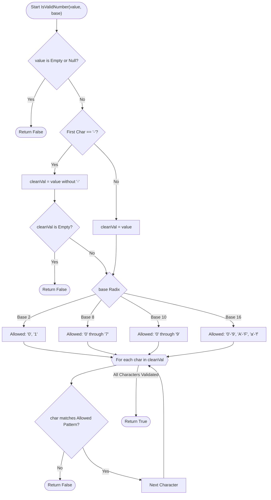

---

## 4. Base Conversion Subroutine Flowcharts

### A. Base-N to Decimal Subroutine (`ParseToDecimal`)
Converts positional string representations into standard integers using Horner's polynomial expansion: $\text{decimal} = (\text{decimal} \times \text{base}) + \text{digit}$.

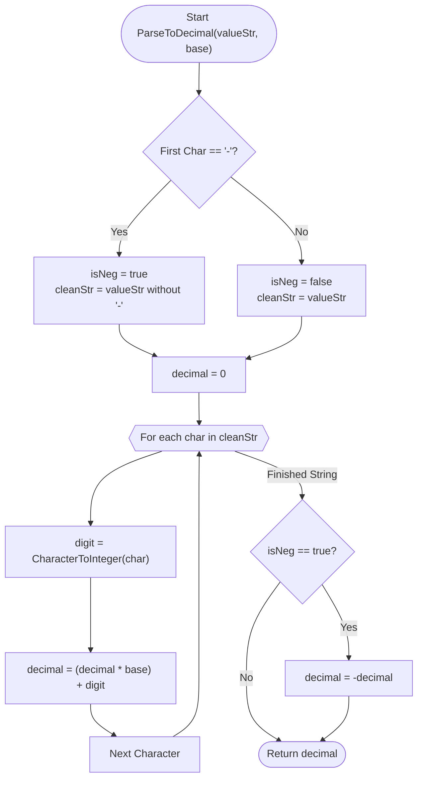

---

### B. Decimal to Target Base Subroutine (`FormatBase`)
Processes both integer and fractional components using repeated division (modulo) and repeated multiplication.

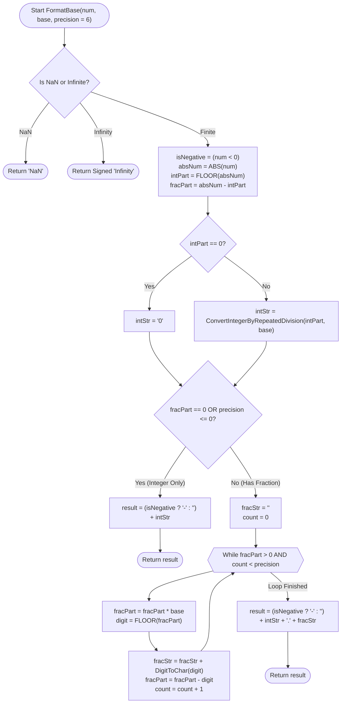

---

## 5. Dynamic Row Management Flowchart (`RenderInputs`)

Illustrates state preservation during dynamic DOM restructuring.

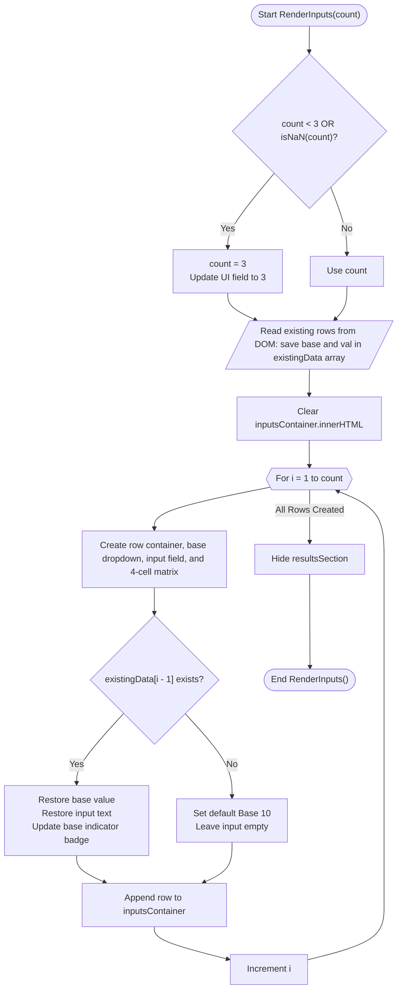

---

## 6. Complement Computation Flowchart

Shows the process for computing both the $(r-1)$'s and $r$'s complements of a number in any base.

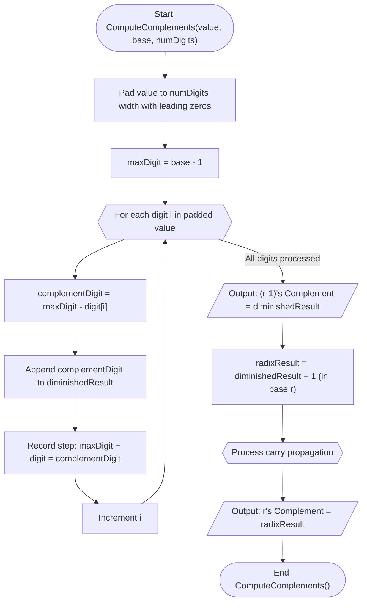

---

## 7. Subtraction via (r-1)'s Complement Flowchart

Shows the end-around carry method for subtraction using diminished radix complement.

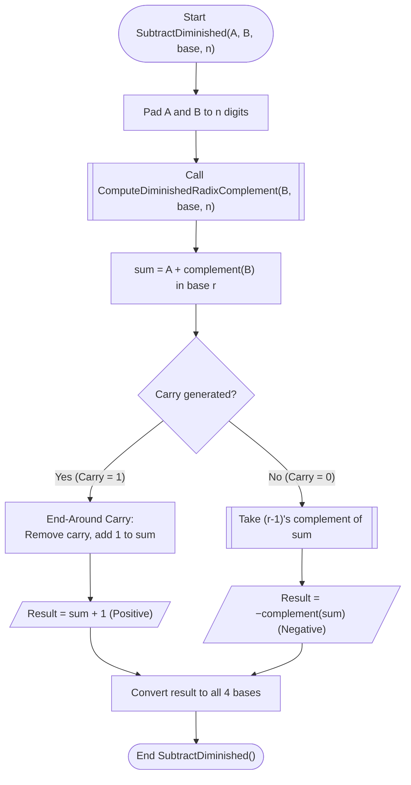

---

## 8. Subtraction via r's Complement Flowchart

Shows the discard-carry method for subtraction using radix complement.

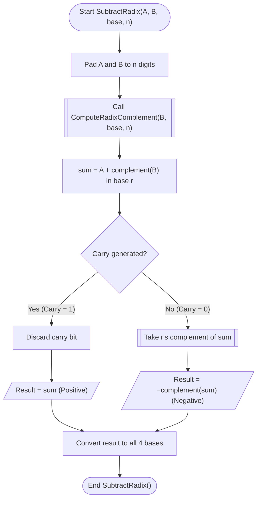

---

## 9. BCD Addition with +6 Rule Flowchart (`AddBCD`)

Details the 8421 BCD addition process including digit padding, 4-bit nibble binary addition, invalid BCD state detection ($>9$ or binary overflow $\ge 16$), automatic $+6$ ($0110_2$) correction, and multi-decade carry propagation.

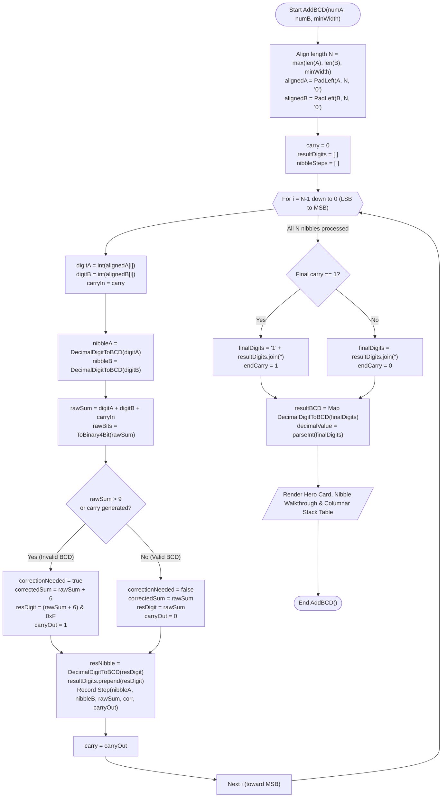

---

## 10. BCD Subtraction via 9's Complement Flowchart (`BCDSubtract9sComplement`)

Details BCD subtraction $A - B$ using 9's complement arithmetic, featuring End-Around Carry addition for positive results and re-complementing for negative results.

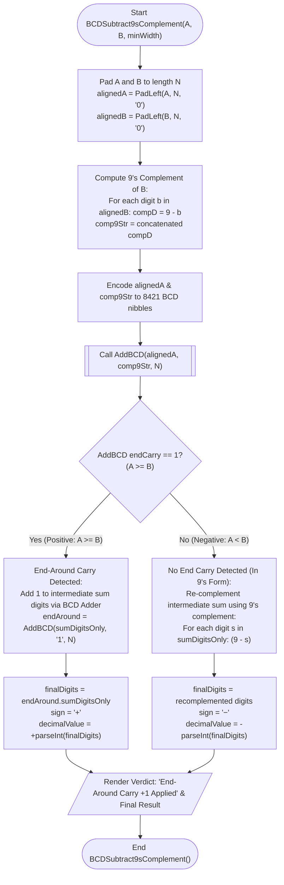

---

## 11. BCD Subtraction via 10's Complement Flowchart (`BCDSubtract10sComplement`)

Details BCD subtraction $A - B$ using 10's complement arithmetic, featuring End Carry Discarding for positive results and 10's complement re-complementing for negative results.

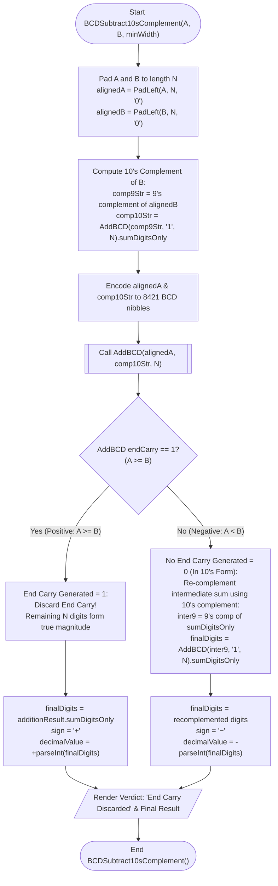

